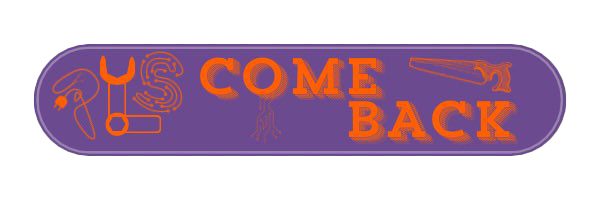

# PlsComeBack

**PlsComeBack** is a fully-featured web application
that is meant to help manage **Fablabs**.

It was made by 8 great IT french students, from
[ISEN](https://www.junia.com/fr/junia/programme-grande-ecole-isen/)
Lille, France, for a school project.

The application was developed using [Node.JS](https://nodejs.org/)
___

## Table of contents

<!--toc:start-->
- [PlsComeBack](#plscomeback)
  - [Table of contents](#table-of-contents)
  - [✏️ Instructions](#️-instructions)
    - [🧰 Requirements (mandatory)](#-requirements-mandatory)
    - [✨ Features (not mandatory)](#-features-not-mandatory)
  - [⚖️ Legal rights](#️-legal-rights)
<!--toc:end-->

___

## ✏️ Instructions

We had some **mandatory instructions**,
and some **additional features** to develop (not mandatory)

### 🧰 Requirements (mandatory)

- 🧩 Using Node.JS to develop the app
- 📅 integration of a booking and borrowing system
- 🌐 [MongoDB](https://www.mongodb.com/) for the database
- 🖥 Separated user & admin pages
- 📷 QR code management system (on laptop and mobile phone)
- 📖 Personal history of borrowing and booking

### ✨ Features (not mandatory)

- ✅ database dockerized
- ✅ homemade API to connect to the DB (in [ExpressJS](https://expressjs.com))
- ✅ the Front-end and Back-end have been separated
- ✅ Selenium tests to ensure the fully working status of the front-end
(the tests of the API were made with a
[Postman](https://www.postman.com/) collection of requests)

___
## 📚 API Documentation

Go see : [API Documentation](./API.md)

___
## 🔍 Installation & How to replicate
⚠️ _This project is under non-commercial license_

Go see : [Installation](./Installation.md)

___

## ⚖️ Legal rights

*PlsComeBack* by Hippolyte DEPARIS, Rémi HAGE, Gaspard CRÉPIN,
Matthieu HOSTE, Hugo MANY, Isaure VICO, Charles ESPRIET,
Camille LANGER is licensed under [CC BY-NC-SA 4.0](./licence.txt)

THIS LICENSE DOES NOT ALLOW COMMERCIAL USE OF THIS APPLICATION
